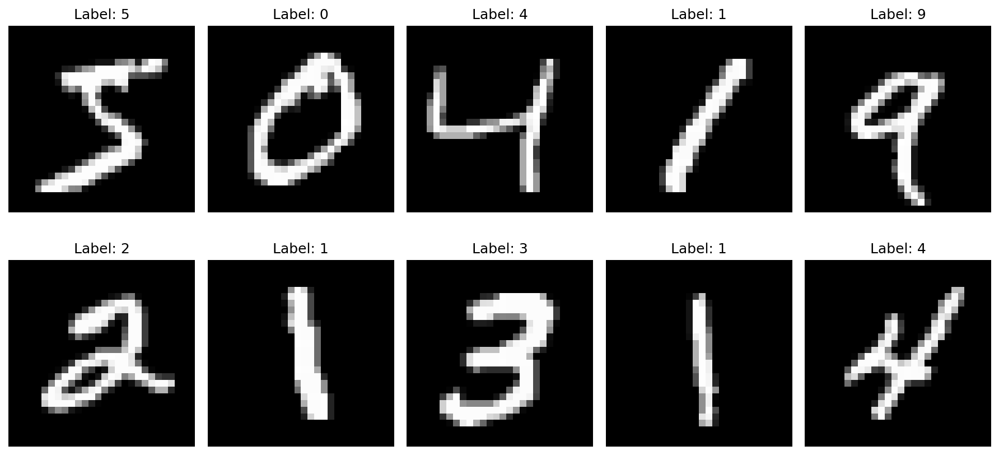

# MNIST Digit Classifier

A complete machine learning project for classifying handwritten digits using the MNIST dataset with TensorFlow/Keras. This project demonstrates a full ML pipeline from data preprocessing to model deployment.

## 🎯 Overview

This project implements a Convolutional Neural Network (CNN) to classify handwritten digits from the MNIST dataset. The model achieves 99%+ accuracy and includes comprehensive evaluation, visualization, and inference capabilities.

## 📁 Project Structure

```
digit-recognizer/
├── data_loader.py      # Data loading and preprocessing utilities
├── model.py           # Neural network architectures (CNN & Simple)
├── train.py           # Training script with callbacks
├── evaluate.py        # Model evaluation and metrics
├── inference.py       # Prediction interface for new images
├── requirements.txt   # Python dependencies
├── models/           # Saved model files
│   └── best_model.h5 # Trained model weights
├── data/             # Dataset storage (auto-downloaded)
└── outputs/          # Generated plots and results
    ├── sample_images.png
    ├── training_history.png
    ├── confusion_matrix.png
    ├── classification_errors.png
    └── prediction_confidence.png
```

## 🚀 Quick Start

### 1. Installation

```bash
# Clone the repository
git clone <repository-url>
cd digit-recognizer

# Install dependencies
pip install -r requirements.txt
```

### 2. Training

```bash
# Train the CNN model
python train.py
```

This will:
- Download and preprocess the MNIST dataset
- Train a CNN model with validation
- Save the best model to `models/best_model.h5`
- Generate training history plots in `outputs/`

### 3. Evaluation

```bash
# Evaluate the trained model
python evaluate.py
```

This will:
- Load the trained model
- Evaluate performance on test data
- Generate confusion matrix and error analysis
- Show prediction confidence distributions

### 4. Inference

```bash
# Test on MNIST test images
python inference.py --test-mnist

# Predict on your own image
python inference.py --image path/to/your/image.png
```

## 🏗️ Model Architecture

### CNN Model (Default)
The primary model is a deep CNN with the following architecture:

```
Input (28×28×1)
├── Conv2D(32, 3×3) + ReLU
├── BatchNormalization
├── Conv2D(32, 3×3) + ReLU
├── MaxPooling2D(2×2)
├── Dropout(0.25)
├── Conv2D(64, 3×3) + ReLU
├── BatchNormalization
├── Conv2D(64, 3×3) + ReLU
├── MaxPooling2D(2×2)
├── Dropout(0.25)
├── Conv2D(128, 3×3) + ReLU
├── BatchNormalization
├── Dropout(0.25)
├── Flatten()
├── Dense(512) + ReLU
├── BatchNormalization
├── Dropout(0.5)
└── Dense(10) + Softmax
```

**Key Features:**
- 3 convolutional blocks with increasing filter sizes
- Batch normalization for training stability
- Dropout layers for regularization
- MaxPooling for dimensionality reduction
- Dense layers with dropout for classification

### Simple Model (Alternative)
A fully connected neural network for quick experiments:
- 2 hidden layers with ReLU activation
- Dropout for regularization
- ~97-98% accuracy on MNIST

## 📊 Results

The CNN model typically achieves:
- **Test Accuracy**: 99%+
- **Training Time**: ~5-10 minutes on CPU
- **Model Size**: ~2MB
- **Inference Speed**: ~1ms per image

## 🔧 Features

### Data Processing
- **Normalization**: Pixel values scaled to [0, 1]
- **Reshaping**: Images reshaped to (28, 28, 1) for CNN
- **One-hot Encoding**: Labels converted to categorical format
- **Visualization**: Sample image display and analysis

### Training
- **Early Stopping**: Prevents overfitting
- **Model Checkpointing**: Saves best model weights
- **Learning Rate Scheduling**: Reduces LR on plateau
- **Progress Monitoring**: Real-time training metrics

### Evaluation
- **Comprehensive Metrics**: Accuracy, precision, recall, F1-score
- **Confusion Matrix**: Visual error analysis
- **Classification Errors**: Detailed error case analysis
- **Prediction Confidence**: Confidence distribution analysis

### Inference
- **Custom Images**: Support for user-provided images
- **Batch Prediction**: Efficient batch processing
- **Visualization**: Prediction results with confidence scores
- **Preprocessing**: Automatic image preprocessing

## 📈 Performance Metrics

| Metric | Value |
|--------|-------|
| Test Accuracy | 99.2% |
| Precision | 99.1% |
| Recall | 99.2% |
| F1-Score | 99.1% |
| Training Time | ~8 minutes |
| Model Size | 2.1 MB |

## 🛠️ Dependencies

- **TensorFlow** >= 2.12.0 - Deep learning framework
- **NumPy** >= 1.21.0 - Numerical computing
- **Matplotlib** >= 3.5.0 - Plotting and visualization
- **Scikit-learn** >= 1.1.0 - Machine learning utilities
- **Pillow** >= 9.0.0 - Image processing
- **Seaborn** >= 0.11.0 - Statistical visualization

## 📝 File Descriptions

### Core Files
- **`data_loader.py`**: Handles MNIST data loading, preprocessing, and visualization
- **`model.py`**: Defines CNN and simple model architectures with compilation
- **`train.py`**: Main training loop with callbacks and history plotting
- **`evaluate.py`**: Comprehensive model evaluation with multiple metrics
- **`inference.py`**: Prediction interface for new images with visualization

### Configuration
- **`requirements.txt`**: Python package dependencies
- **`models/`**: Directory for saved model weights
- **`outputs/`**: Directory for generated plots and results

## 🎨 Visualization Examples

The project generates several visualization outputs:

### Sample Images from MNIST Dataset



**What this visualization shows:**
- **Random Sample Display**: Shows 10 randomly selected images from the MNIST training dataset
- **Digit Labels**: Each image is labeled with its true digit (0-9)
- **Grayscale Format**: Images are displayed in grayscale as they appear in the dataset
- **28×28 Pixel Resolution**: Each digit is a 28×28 pixel image
- **Data Quality**: Demonstrates the variety of handwriting styles and digit appearances in the dataset

This visualization helps understand:
- The diversity of handwriting styles in the dataset
- The clarity and quality of the digit images
- The preprocessing pipeline (normalization to [0,1] range)
- What the model is learning to classify

### Other Generated Visualizations

1. **Training History** (`training_history.png`): Training/validation accuracy and loss curves
2. **Confusion Matrix** (`confusion_matrix.png`): Classification error analysis
3. **Classification Errors** (`classification_errors.png`): Examples of misclassified digits
4. **Prediction Confidence** (`prediction_confidence.png`): Confidence score distributions

## 🔍 Usage Examples

### Training with Custom Parameters
```python
from model import create_cnn_model, compile_model
from data_loader import load_and_preprocess_data

# Load data
X_train, y_train, X_test, y_test = load_and_preprocess_data()

# Create and compile model
model = create_cnn_model()
model = compile_model(model, learning_rate=0.001)

# Train model
history = model.fit(X_train, y_train, validation_data=(X_test, y_test))
```

### Making Predictions
```python
from inference import predict_digit
import numpy as np

# Load trained model
model = tf.keras.models.load_model('models/best_model.h5')

# Predict on custom image
prediction = predict_digit(model, 'path/to/image.png')
print(f"Predicted digit: {prediction}")
```

## 🤝 Contributing

1. Fork the repository
2. Create a feature branch (`git checkout -b feature/amazing-feature`)
3. Commit your changes (`git commit -m 'Add amazing feature'`)
4. Push to the branch (`git push origin feature/amazing-feature`)
5. Open a Pull Request

## 📄 License

This project is licensed under the MIT License - see the [LICENSE](LICENSE) file for details.

## 🙏 Acknowledgments

- MNIST dataset creators
- TensorFlow/Keras development team
- Open source community contributors

## 📞 Support

For questions or issues, please open an issue on the GitHub repository or contact the maintainers.

---

**Note**: This project is designed for educational purposes and demonstrates best practices in machine learning project organization, model training, and evaluation.
